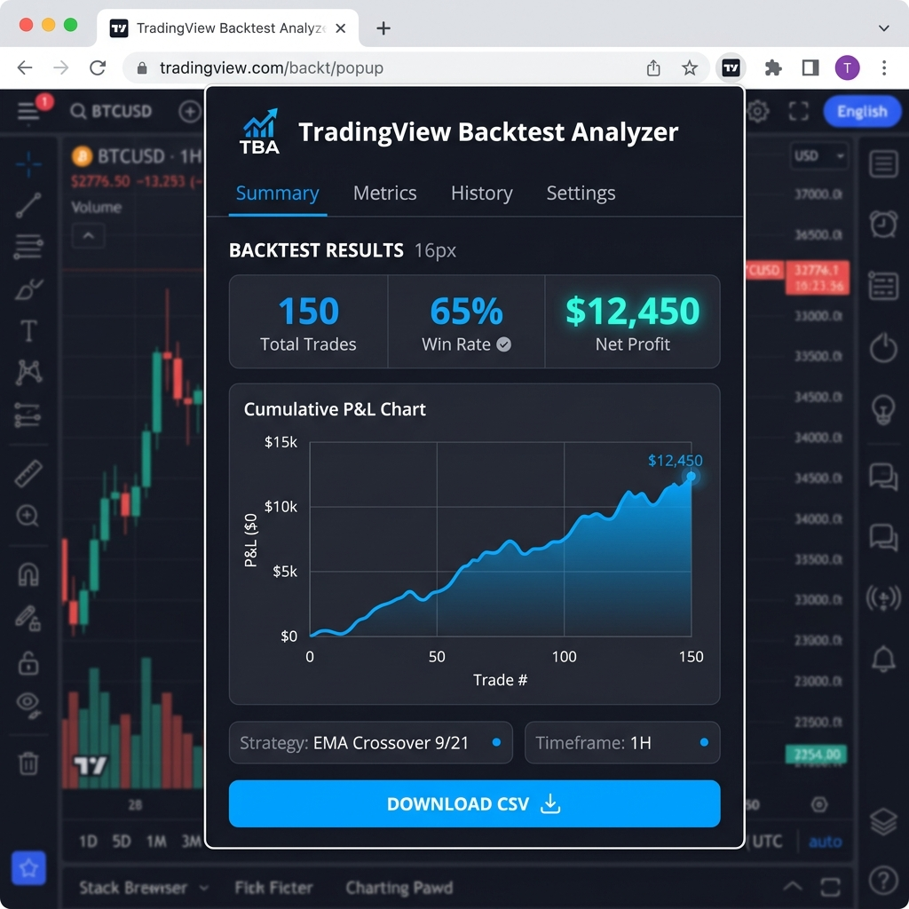

# 📈 TradingView Backtest Analyzer

A powerful Chrome extension designed for traders who use TradingView. This tool scrapes your backtest reports directly from the "List of Trades" tab and provides a detailed, visual analysis of your strategy's performance.

## ✨ Features

-   **🚀 One-Click Analysis**: Automatically scrapes all trades from your TradingView Strategy Tester.
-   **📊 Visual Insights**: Generates a cumulative P&L chart to visualize your strategy's equity curve.
-   **📈 Key Metrics**: Instantly calculates Win/Loss ratio, Total Profit, Total Loss, and Net Profit.
-   **📥 CSV Export**: Download your full trade history as a CSV file for further analysis in Excel or Google Sheets.
-   **🌑 Modern UI**: Sleek, dark-themed interface designed to complement the TradingView aesthetic.

## 🛠️ Installation

Since this extension is in development, you can install it manually:

1.  **Download** or **Clone** this repository to your local machine.
2.  Open your browser and navigate to `chrome://extensions/`.
3.  Enable **Developer mode** (toggle in the top right corner).
4.  Click **Load unpacked**.
5.  Select the folder containing this extension (`backtest_analyzer_extension`).

## 📖 How to Use

1.  Go to [TradingView](https://www.tradingview.com/) and open a chart.
2.  Apply a strategy to the chart and open the **Strategy Tester** panel at the bottom.
3.  Click on the **List of Trades** tab.
4.  Click the **TradingView Backtest Analyzer** icon in your browser toolbar.
5.  Click **Analyze Results**.
6.  *Wait a few seconds while the extension scrolls and scrapes the data.*
7.  View your results and click **Download CSV** to save the report.

## 🧰 Technology Stack

-   **JavaScript (ES6+)**: Core logic and DOM manipulation.
-   **HTML5/CSS3**: Responsive and modern UI design.
-   **Chart.js**: High-performance charting library.
-   **Chrome Extension API (Manifest v3)**: Secure and efficient extension architecture.

## 🤝 Contributing

Contributions are welcome! Please see [CONTRIBUTING.md](CONTRIBUTING.md) for guidelines.

## 📄 License

This project is licensed under the MIT License - see the [LICENSE](LICENSE) file for details.

---

*Disclaimer: This tool is not affiliated with TradingView. Use it responsibly and at your own risk.*
